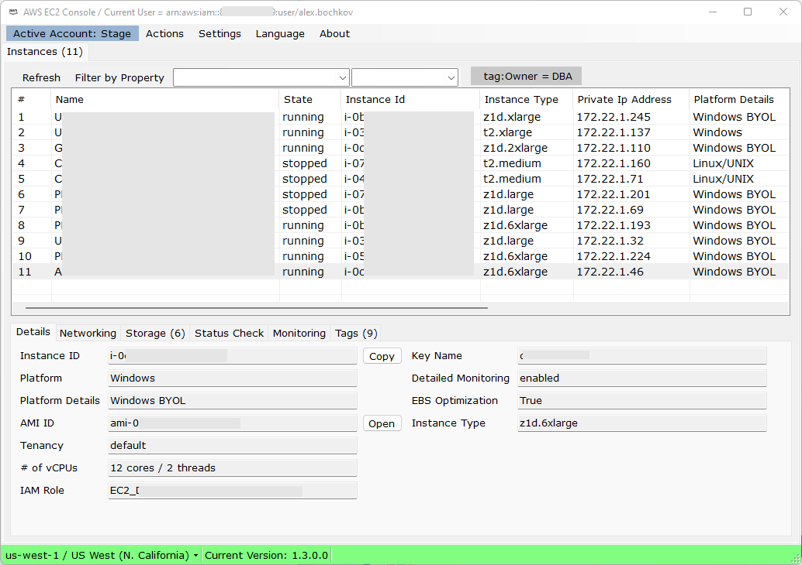

## Windows Desktop version of AWS EC2 Console
Windows Forms based desktop application that duplicates the most common functions of AWS EC2 Console.
Fully based on the official AWS .NET SDK using .NET 5.

**I just started working on it, there are not enough features yet to make it usable and useful. Check back a bit later.**

## Key Features 
1. <..tbd..>

## Security
1. AWS Access Key should have full admin access.
2. Account settings with sensitive credentials are stored in application settings in encrypted form using standard Windows cryptographic functionality `System.Security.Cryptography.ProtectedData`. I assume this is safe enough.

## Your help and feedback is very welcome
1. Fast and nice looking UI is everything. Please let me know if there are better *free* Windows Forms components that can be helpful here.
2. Constructive feeback in appriciated in issues. 

## FAQ
1. <b>Should I use this app?</b> Use at your own risk. I do not provide any support but appreciate your feedback in issues.
2. <b>Why would you duplicate something that already exists?</b> 
As an engineer who work with AWS for over a decade, I'm deeply frustrated with the development direction of the Console - aweful, unreadable and slow UI.
The goal for this solution is to fix address those issues.
3. <b>Why vb.net?</b> I'm Windows user, I like .NET, I like Visual Basic, I enjoy writing it.
4. <b>Your code is aweful!</b> I'm a database architect, not a software engineer. Also, a big fan of incremental development and improvement. 
5. <b>Do you have a release schedule?</b> No, this is a pet project with no dedicated resources. 
