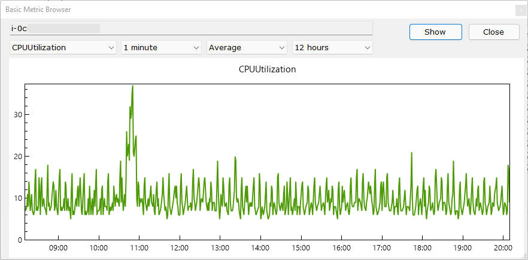
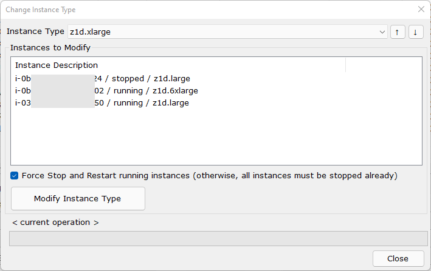

## Windows Desktop version of AWS EC2 Console
A Windows Forms desktop application that duplicates the most common functions of the AWS EC2 Console.
Fully based on the official AWS .NET SDK using .NET 5.0.

### < The project is currently at an early stage of development >

## Key Features 
1. Faster than the official AWS Console.
2. Dense interface with everything you need on one screen.
3. Additional automation for multi-step changes, for example: 
3.1. Bulk instance type change which includes stopping running instances, changing instance type, and restarting instances. 
3.2. Bulk create and attach EBS volumes to an instance. 
3.3. ...wip...
4. ..

## Form Examples
**Main form** 

**Metric browser** 

**Bulk instance type change** 

## Security
1. At the moment, AWS security credentials should have at least full read-only access to work more or less stable.
2. Two authentication methods are supported:
2.1. Credential Profiles with plain text Access and Security Keys - profiles are stored using native NetSDKCredentialsFile format and shared with AWS Toolkit for Visual Studio and PowerShell modules.
2.2. <a href="https://docs.aws.amazon.com/singlesignon/latest/userguide/what-is.html">AWS Single Sign-On</a>. Credentials are not stored locally, they are requested as needed.
3. I am tracking application usage by calling the AWS API Gateway endpoint every time the application starts. Please refer to the CheckForTheAppUpdatesAndtrackUsage_Async function in the main form - no data is sent at all.

## Your help and feedback is greatly appreciated
1. A fast and nice-looking interface is everything. Please let me know if there are any better *free* Windows Forms components that you might find useful here.
2. Constructive feedback is appreciated in <a href="https://github.com/alex-bochkov/ec2-console/issues">project issues</a>.

## FAQ
1. **Should I use this app?** Use at your own risk. I don't provide any support, but appreciate your feedback in <a href="https://github.com/alex-bochkov/ec2-console/issues">project issues</a>.
2. **Why would you duplicate something that already exists?** As an engineer who work with AWS for over a decade, I'm deeply frustrated with the development direction of the Console - aweful, unreadable and slow UI.
The purpose of this solution is to address those issues.
3. **Why vb.net?** I'm a Windows user, I like .NET, I like Visual Basic, I enjoy writing it.
4. **Your code is aweful!** I'm a database architect, not a software engineer. Also, a big fan of incremental development and improvement. 
5. **Do you have a release schedule?** No, this is a pet project without dedicated resources. 
6. **It throws exceptions!** There are no plans at this time to make it fool-proof.
